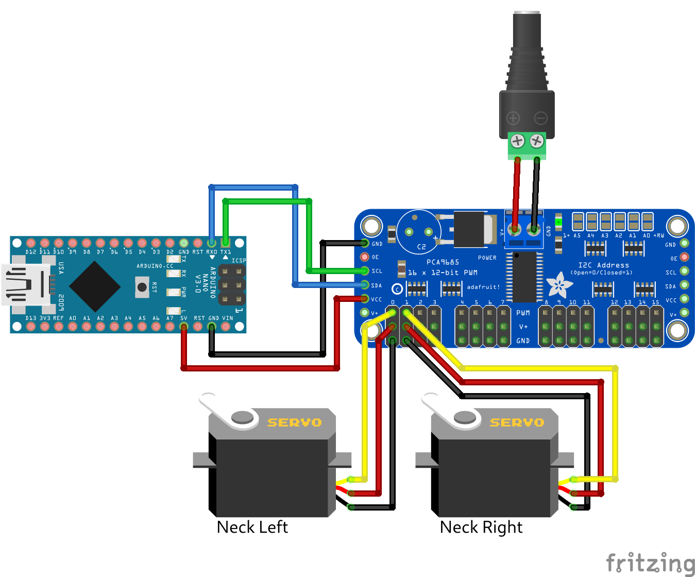

# Adafruit PCA9685

Using an Adafruit PCA9685 module to send servo positions.

This approach is especially useful when the animation is based on multiple servos. We assume the servo ID and the used board channel are equal. Therefore, the servo with the ID 0 has to be connected to channel 0 etc.

## Library Dependencies

- [Adafruit-PWM-Servo-Driver-Library](https://github.com/adafruit/Adafruit-PWM-Servo-Driver-Library)

## Wiring Diagram

