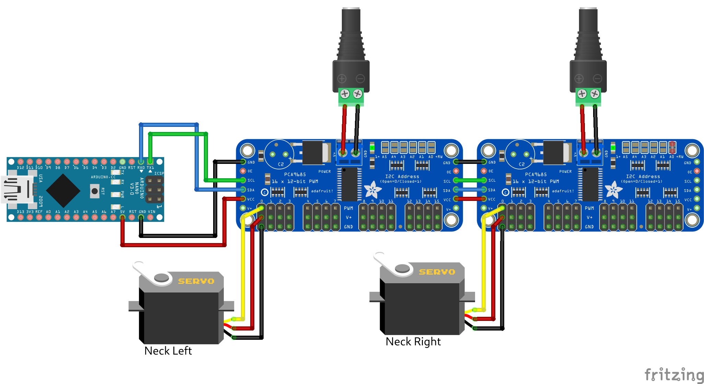

# Multiple PCA9685

Using two PCA9685 PWM Servo Drivers to animate 2 servos. The animation is based on the IK example of the Blender Servo Animation add-on which resembles a simple neck mechanism.

Note that the A0 address jumper has to be soldered on the second driver board. This setup can easily be extended to animate up to 32 servos. If even more servos are needed, you can also add more driver boards to the chain.

