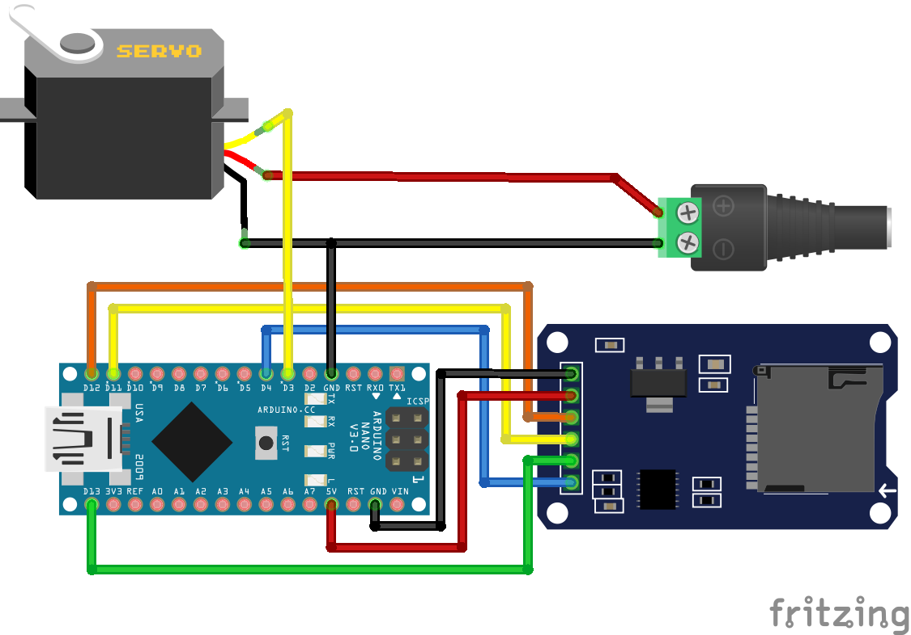

# SD Card Animation Data

Reading animation data from an SD card.

The setup requires nothing but a micro controller and a single servo. It uses the standard Arduino servo library to send servo positions.

## Library Dependencies

- [SD](https://github.com/arduino-libraries/SD)
- [Servo](https://github.com/arduino-libraries/Servo)
- [ESP32Servo](https://github.com/madhephaestus/ESP32Servo) (alternatively, when using an ESP32)

## Wiring Diagram

