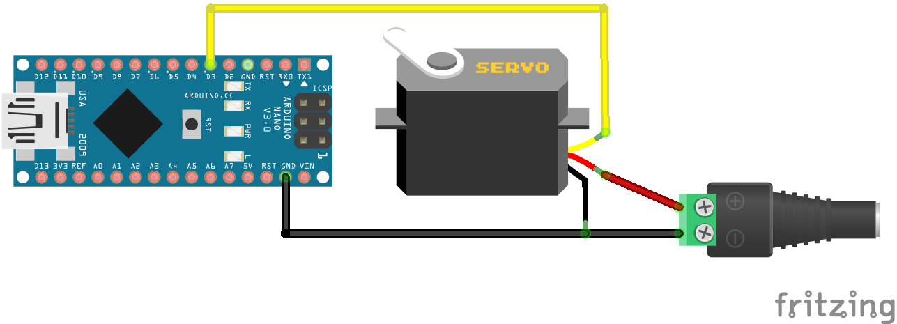

# Standard Servo Library

Using the standard Arduino servo library to send servo positions.

The setup requires nothing but a micro controller and a single servo. The animation is played in a loop.

## Library Dependencies

- [Servo](https://github.com/arduino-libraries/Servo)
- [ESP32Servo](https://github.com/madhephaestus/ESP32Servo) (alternatively, when using an ESP32)

## Wiring Diagram

