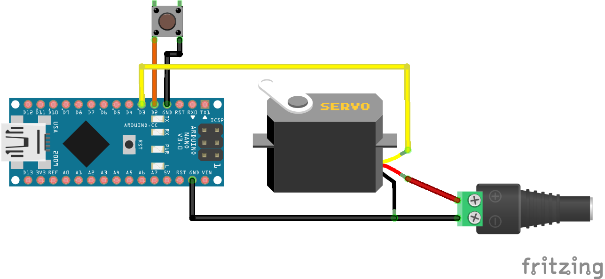

# Switch Mode Button

Using a button to switch between different modes and control the animation.

We are using a button to handle both short and long presses. Note that the servo will not move until the button is shortly pressed to start the animation.

Starting the animation will only play it once, so another button press is required to play it again. A long press will stop the animation and slowly move the servo to its neutral position.

## Library Dependencies

- [OneButton](https://github.com/mathertel/OneButton)
- [Servo](https://github.com/arduino-libraries/Servo)
- [ESP32Servo](https://github.com/madhephaestus/ESP32Servo) (alternatively, when using an ESP32)

## Wiring Diagram

