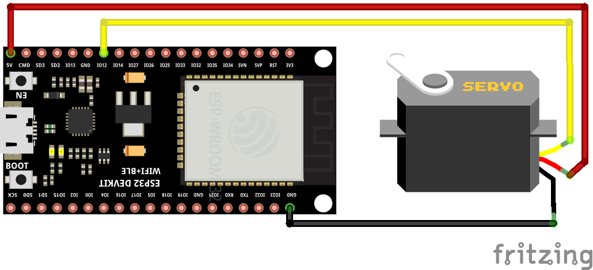

# Web Socket Live Mode

Sending live servo positions via web socket commands.

This example requires an ESP32 and a running Blender instance with the Blender Servo Animation Add-on. However, this example could be slightly adjusted to work with other WiFi-capable micro controllers as well.

