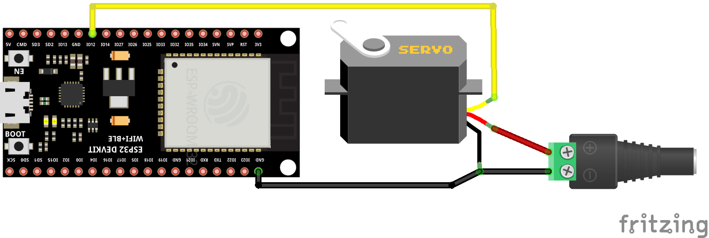

# Web Socket Live Mode

Sending live servo positions via web socket commands.

This example requires an ESP32 and a running Blender instance with the Blender Servo Animation Add-on. We create an web socket server to receive live position values via Blender and move a single servo.

## Library Dependencies

- [ESP32Servo](https://github.com/madhephaestus/ESP32Servo)
- [ESPAsyncWebServer](https://github.com/esphome/ESPAsyncWebServer)

## Wiring Diagram

